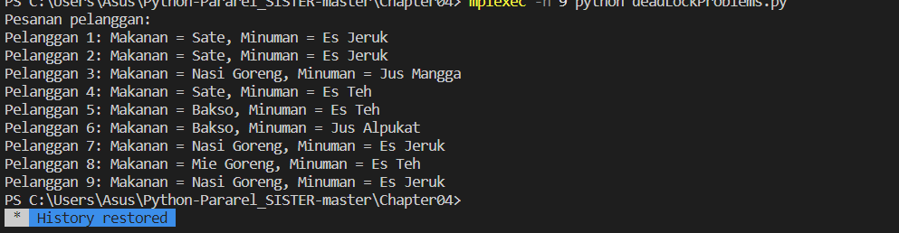

 MPI (Message Passing Interface) di gunakan untuk mensimulasikan sebuah sistem pemesanan makanan dan minuman di sebuah restoran. Berikut adalah langkah-langkah yang dilakukan oleh kode di atas:
 Impor modul MPI dan inisialisasi communicator, rank, dan size.
 Inisialisasi list makanan dan minuman. Hal ini hanya dilakukan oleh proses 0.
 List makanan dan minuman dicasting ke semua proses menggunakan fungsi comm.bcast.
Setiap proses memilih secara acak makanan dan minuman dari list yang diterima menggunakan fungsi random.choice.
Pesanan dari setiap proses dikumpulkan menggunakan fungsi comm.gather.
Terakhir, proses 0 menampilkan hasil pesanan dari setiap pelanggan menggunakan perulangan for.
Dalam keseluruhan, kode di atas mensimulasikan sebuah restoran di mana beberapa pelanggan melakukan pemesanan secara bersamaan, dan pesanan tersebut diproses secara paralel menggunakan MPI.
