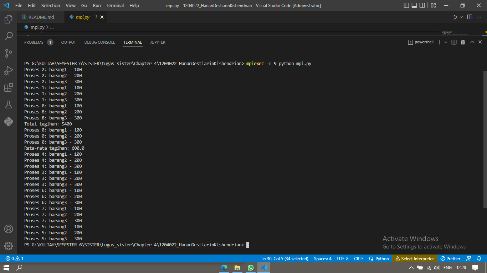
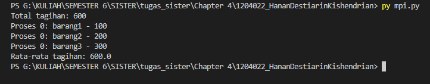

Pada tugas kali ini mengambil studi kasus tentang sebuah tagihan. berikut penjelasannya :

menggunakan modul mpi4py, pada baris kode from mpi4py import MPI digunakan untuk mengimport modul MPI dari package mpi4py

pada baris kode berikut ini untuk menginisialisasikan MPI
comm = MPI.COMM_WORLD : digunakan untuk menginisialisasikan komunikasi MPI
rank = comm.Get_rank() : digunakan untuk mendapatkan rank atau nomor proses yang sedang dijalankan
size = comm.Get_size() : digunakan digunakan untuk mendapatkan jumlah total proses yang sedang berjalan

items = {'barang1': 100, 'barang2': 200, 'barang3': 300} : membuat dictionary yang berisi harga serta jumlah barang

subtotal = 0 : digunakan untuk mendefinisikan variabel subtotal dengan nilai yang berawalan 0

for item in items.values():
subtotal += item
pada kode di atas digunakan untuk perulangan dari setiap value pada directory items

total = comm.allreduce(subtotal, op=MPI.SUM) : digunakan untuk mengumpulka nilai subtotal dari setiap prosesnya dengan menggunakan operasi MPI.SUM dan setelah di peroleh hasiilnya, hasil akan dimasukan ke dalam variable total

if rank == 0: digunakan untuk mengecek apakah nomor proses yang sedang berjalan adalah 0 (root)

print(f'Total tagihan: {total}') : digunakan untuk menampilkan total dari tagihan jika proses yang sedang berjalan adalaha 0

for item, price in items.items(): digunakan untuk melakukan pengulangan pada setiap value dari directory items

print(f'Proses {rank}: {item} - {price}') : digunakan untuk menampilkan daftar barang serta harga pada setiap prosesnya

avg = total / size : digunakan untuk menghitung rata-rata tagihan dengan membagi total tagihan dengan jumlah proses

print(f'Rata-rata tagihan: {avg}') : digunakan untuk menampilkan hasil rata-rata tagihan jika proses yang sedang berjalan nya adalah root

output yang di hasilkan adalah sebagai berikut :
jika di run menggunakan mpiexec -n 9 python mpi.py maka hasil nya akan seperti berikut ini :

jika di run menggunakan py mpi.py maka hasilnya akan seperti berikut ini :

