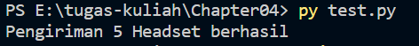
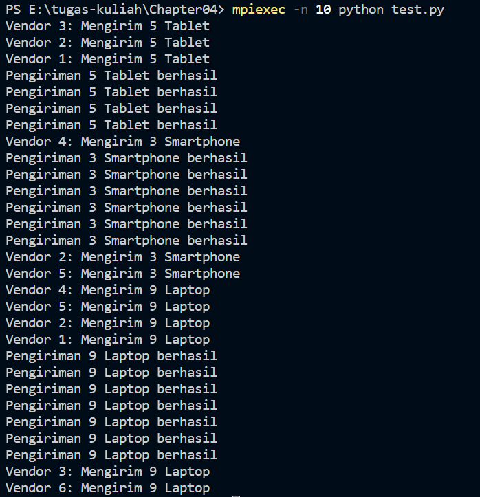

## PRAKTIKUM MPI

Studi kasus yang diambil yaitu di bidang logistik dalam distribusi barang. Dalam program yang dibuat, setiap vendor pada program tersebut akan mengirimkan barang dengan jumlah tertentu dan nama barang yang berbeda. Setelah pengiriman berhasil dilakukan, maka masing-masing vendor akan memberikan konfirmasi bahwa barang yang dikirim telah berhasil sampai kepada semua vendor yang ada.

Pada awal program, dilakukan inisialisasi MPI dengan memanggil fungsi MPI.COMM_WORLD untuk mendapatkan objek communicator global, MPI.Get_rank() untuk mendapatkan rank (nomor identitas) proses saat ini, dan MPI.Get_size() untuk mendapatkan jumlah total proses yang berjalan.

Kemudian dilakukan split komunikator MPI menjadi beberapa grup dengan nilai rank yang acak dengan memanggil fungsi MPI.Split() dan memberikan parameter color yang dihasilkan dari nilai random. Setelah itu, dilakukan broadcast data barang dari rank 0 ke seluruh rank lainnya dengan memanggil fungsi MPI.bcast().

Setiap proses yang bukan rank 0 akan melakukan proses pengiriman barang dengan mencetak pesan yang berisi jumlah barang dan nama barang yang dikirimkan. Setelah proses pengiriman selesai, semua proses akan melakukan MPI.allgather() untuk menerima konfirmasi pengiriman dari seluruh rank.

Pada akhir program, jika proses saat ini memiliki rank 0, maka akan dilakukan iterasi pada konfirmasi untuk menampilkan hasil konfirmasi pengiriman dari seluruh rank. Nama barang yang akan dikirimkan diambil dari list nama_barang yang sudah didefinisikan sebelumnya dengan fungsi random.choice().

Output :

Tanpa MPI

Dengan MPI

