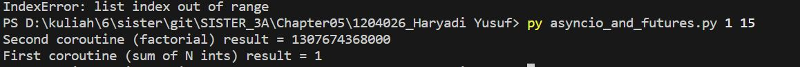
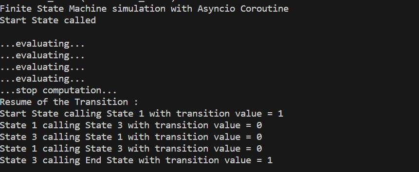
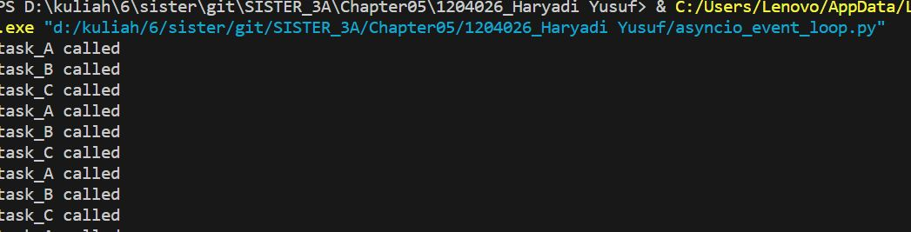
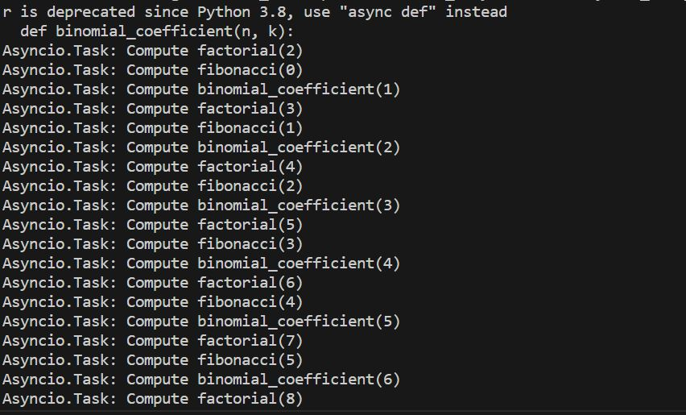
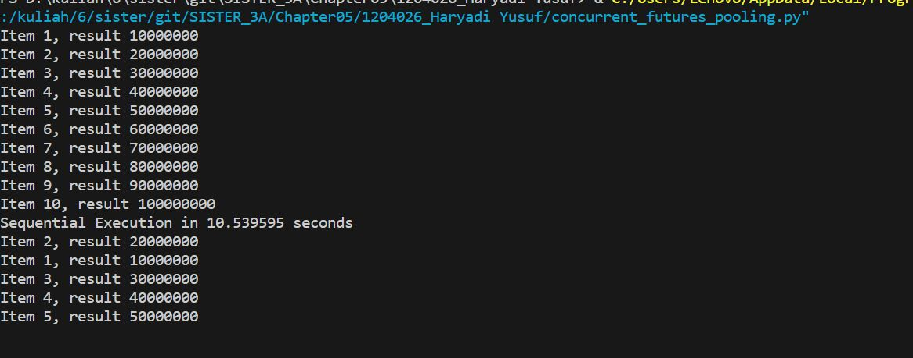

futures
Kode tersebut menggunakan modul asyncio pada Python untuk mengimplementasikan concurrent programming dengan menggunakan coroutine. Dua coroutine digunakan dalam kode tersebut. Yang pertama adalah first_coroutine, yang menghitung jumlah n bilangan bulat pertama, dan yang kedua adalah second_coroutine, yang menghitung faktorial dari n. Kedua coroutine tersebut dijalankan secara asynchronous dalam event loop yang disediakan oleh modul asyncio.
Kode tersebut meminta input dari dua bilangan n, yang diberikan melalui argumen baris perintah saat menjalankan kode. Kemudian, dua future object dibuat untuk menampung hasil dari masing-masing coroutine. Kemudian, dua coroutine dimasukkan ke dalam list tasks dan dijalankan secara asynchronous dengan asyncio.wait(). Saat coroutine selesai dijalankan, hasilnya disimpan ke dalam future object yang sesuai dengan set_result(). Setiap future object memiliki sebuah callback yang dipanggil ketika future object selesai diisi. Callbacknya adalah fungsi got_result, yang mencetak hasil dari future object yang bersangkutan.

coroutine
Kode tersebut merupakan contoh implementasi mesin keadaan hingga dengan menggunakan coroutine dari asyncio pada Python. Kode tersebut menggambarkan simulasi mesin keadaan hingga yang terdiri dari 4 state (start_state, state1, state2, state3) dan satu state akhir (end_state). Setiap state memiliki nilai-nilai transisi yang dihasilkan secara acak (0 atau 1), dan masing-masing state akan mengevaluasi nilai transisi tersebut untuk memutuskan state selanjutnya yang akan dipanggil. Setelah mengevaluasi nilai transisi, state akan melakukan sleep selama 1 detik sebelum memanggil state selanjutnya. State terakhir (end_state) mengakhiri simulasi dan mengembalikan output nilai transisinya. Seluruh fungsi state menggunakan coroutine dengan decorator @asyncio.coroutine dan yield from untuk memanggil state selanjutnya secara asynchronous.

event loop
Kode tersebut adalah contoh implementasi asynchronous programming menggunakan asyncio di Python. Program ini memiliki tiga fungsi yaitu task_A, task_B, dan task_C. Ketiga fungsi tersebut saling memanggil satu sama lain dengan jeda waktu tertentu menggunakan loop.call_later(), hingga waktu yang telah ditentukan habis (60 detik). Implementasi asyncio memungkinkan kode yang dieksekusi tidak harus menunggu tugas sebelumnya selesai, sehingga dapat meningkatkan efisiensi dan kecepatan program.

task manipulation
Kode tersebut menggunakan Asyncio.Task untuk menjalankan tiga fungsi matematika (factorial, fibonacci, dan binomial_coefficient) secara bersamaan atau parallel. Setiap fungsi melakukan perhitungan dan mencetak pesan di setiap iterasi. Pada setiap iterasi juga terdapat yield from asyncio.sleep(1), yang memberikan kesempatan untuk menjalankan tugas lain selama 1 detik sebelum melanjutkan perhitungan. Akhirnya, task_list ditambahkan dengan tiga tugas tersebut, lalu dijalankan menggunakan event loop asyncio.

concurrent
Kode tersebut mengukur waktu eksekusi dari tiga cara berbeda dalam menjalankan fungsi count pada list number_list.
Cara pertama yaitu sequential execution, di mana fungsi evaluate dipanggil secara berurutan untuk setiap item dalam number_list.
Cara kedua yaitu thread pool execution, di mana thread pool executor dibuat dengan max_workers=5, kemudian fungsi evaluate dijalankan dalam thread yang tersedia dari thread pool executor.
Cara ketiga yaitu process pool execution, di mana process pool executor dibuat dengan max_workers=5, kemudian fungsi evaluate dijalankan dalam proses yang tersedia dari process pool executor.
Untuk setiap cara, waktu mulai dieksekusi start_time dan waktu akhir dieksekusi end_time dicatat dan dicetak bersama dengan cara eksekusi yang digunakan.

