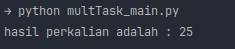

# Celery
> Studi kasus perkalian

**module yang dibutuhkan adalah celery**

### Python Version

1. multTask.py   File multTask.py memiliki fungsi multiply yang menjadi tugas Celery. Fungsi ini menerima dua argumen bilangan bulat x dan y dan mengembalikan hasil perkalian dari kedua bilangan. Dengan mendekorasi fungsi ini sebagai tugas Celery menggunakan @app.task, kita membuatnya menjadi tugas yang dapat dijalankan secara asinkron dengan menggunakan Celery.
2. multTask_main.py    Pada file multTask_main.py, modul multTask diimpor yang berisi definisi tugas perkalian menggunakan Celery. Fungsi multiply dari modul tersebut dipanggil dengan memberikan argumen bilangan 5 dan 5. Hasil perkalian akan dikembalikan oleh tugas Celery dan disimpan dalam variabel result kemudian akan diprint ke console mengugnakan keyword print.

Result :  
