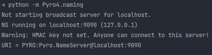
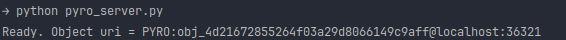

# Pyro4

### Python Version

> Sebelum menjalankan pyro_server harus mengeksekusi perintah "python -m Pyro4.naming"  untuk menjalankan server dari
> module Pyro4

1. pyro_client.py   File pyro_client.py memiliki tujuan untuk menghubungkan dengan server menggunakan protokol Pyro (
   Python Remote Objects) dan memperoleh pesan selamat datang dari server. Di dalam file tersebut, pengguna diminta
   untuk memasukkan namanya melalui input yang kemudian disimpan dalam variabel "name". Selanjutnya, objek proxy "
   server" dibuat menggunakan Pyro4.Proxy() dan dihubungkan dengan server melalui nama "PYRONAME:server". Pesan selamat
   datang akan diterima dari server melalui metode welcomeMessage pada variabel server.
   

2. pyro_server.py   File pyro_server.py memiliki tujuan untuk menjalankan server Pyro yang dapat menerima permintaan
   dari klien dan memberikan respons berupa pesan selamat datang. Di file tersebut, ada metode pada class Server yang
   memiliki decorator @Pyro4.expose yang bertujuan mengekspos metode welcomeMessage sebagai metode yang dapat dipanggil
   dari klien. Fungsi startServer digunakan untuk memulai server dengan cara membuat objek server, daemon Pyro,
   menemukan name server yang berjalan, mendaftarkan objek server sebagai objek Pyro, dan memulai lingkaran peristiwa
   server untuk menunggu panggilan dari klien. Setelah server dijalankan, URI objek Pyro diprint untuk digunakan pada
   klien. File pyro_server.py berperan sebagai server Pyro yang siap menerima permintaan dan memberikan respons kepada
   klien.  