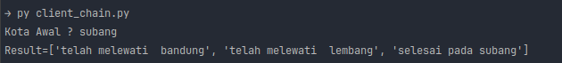
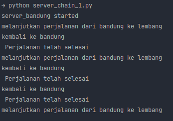
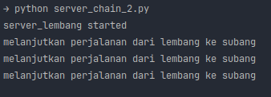
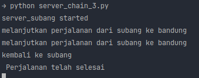

# Pyro4

### Python Version

> Sebelum menjalankan pyro_server harus mengeksekusi perintah "python -m Pyro4.naming"  untuk menjalankan server dari
> module Pyro4

1. chainTopology.py   File chainTopology.py memiliki tujuan untuk mengimplementasikan sebuah rantai (chain) yang
   terdiri dari beberapa server menggunakan Pyro4. Di dalam file tersebut, terdapat kelas
   Chain yang didekorasi dengan @Pyro4.expose, yang bertanggung jawab untuk mengatur aliran pesan melalui server-server
   dalam rantai. Setiap objek Chain memiliki atribut name yang menyimpan nama server saat ini, current_serverName yang
   menyimpan nama server berikutnya dalam rantai, dan current_server yang berfungsi sebagai proxy untuk server
   berikutnya. Metode process digunakan untuk memproses pesan yang diterima, dimana jika current_server masih kosong,
   maka akan diinisialisasi dengan memanggil server berikutnya menggunakan Pyro4.core.Proxy. Jika nama server saat ini
   terdapat dalam pesan, maka perjalanan dianggap selesai dan pesan "Perjalanan telah selesai" akan dicetak. Jika tidak,
   pesan akan diteruskan ke server berikutnya dengan memanggil metode process pada current_server dan mengembalikan
   hasilnya. Selain itu, pesan juga akan dimodifikasi dengan menambahkan informasi bahwa pesan telah melewati server
   saat ini sebelum diteruskan ke server berikutnya. File chainTopology.py berfungsi sebagai komponen dalam pembentukan
   rantai server dan mengatur aliran pesan di antara mereka.
2. client_chain.py  
   File chain_client.py berfungsi sebagai klien yang berinteraksi dengan sistem rantai server menggunakan Pyro4.
   Pengguna diminta untuk memasukkan namanya, kemudian klien membuat objek proxy menggunakan Pyro4 untuk terhubung
   dengan server di kota Bandung. Klien mengirimkan pesan dengan nama yang dimasukkan sebagai argumen ke metode "
   process" pada objek proxy. Hasilnya akan dicetak sebagai output. File ini bertanggung jawab untuk menginisiasi
   koneksi dengan server dan mengirimkan pesan kepada server dalam rantai.   
3. server_chain_1.py, server_chain_2.py, server_chain_3.py   File server_chain_1.py, server_chain_2.py, dan
   server_chain_3.py berfungsi sebagai server dalam sistem rantai pada Pyro4. Server ini menggunakan modul
   chainTopology yang telah didefinisikan sebelumnya untuk mengatur proses dalam
   rantai.         