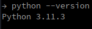
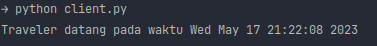
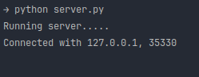
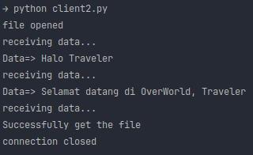

# Pyro4

### Python Version

1. client.py  
   File client.py berfungsi sebagai klien dalam komunikasi jaringan menggunakan protokol TCP. Klien ini membuat objek
   socket dan melakukan koneksi dengan server menggunakan host dan port yang ditentukan. Setelah koneksi terjalin, klien
   menerima pesan dari server dengan ukuran maksimum 1024 byte, kemudian menutup koneksi. Pesan yang diterima dari
   server di-decode menggunakan format ASCII dan ditampilkan di layar.  
2. server.py   File server.py berfungsi sebagai server dalam komunikasi jaringan menggunakan protokol TCP. Server ini
   membuat objek socket dan melakukan binding ke alamat host dan port tertentu. Kemudian, server ini mendengarkan (
   listen) hingga 5 permintaan koneksi dari klien. Saat ada koneksi masuk, server menerima koneksi tersebut, mengirimkan
   pesan berisi waktu saat ini kepada klien, dan menutup koneksi. Pada saat server ditutup, socket akan ditutup secara
   otomatis.  
3. client2.py  
   File client.py berfungsi sebagai klien dalam komunikasi jaringan menggunakan protokol TCP. Klien ini membuat objek
   socket dan melakukan koneksi ke server menggunakan alamat host dan port tertentu. Setelah terhubung, klien
   mengirimkan pesan 'HelloServer!' ke server. Selanjutnya, klien membuka file 'received.txt' dalam mode penulisan
   biner, kemudian menerima data dari server dengan ukuran buffer sebesar 1024 byte. Klien menulis data yang diterima ke
   dalam file tersebut hingga tidak ada data yang diterima. Setelah selesai, klien menutup file dan mencetak pesan "
   Successfully get the file". Terakhir, klien menutup koneksi dengan server dan mencetak pesan "connection
   closed".   