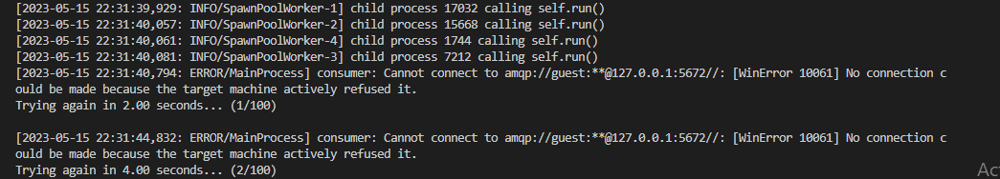
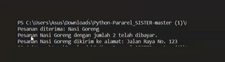
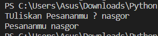
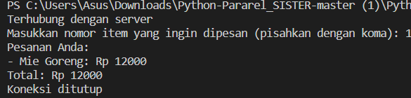
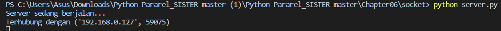
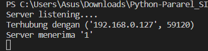

link youtobe : https://youtu.be/-TWUTms6BEc

Celery adalah sebuah framework (kerangka kerja) yang digunakan untuk mengembangkan aplikasi berbasis pemrosesan tugas asinkron dan jadwal dalam bahasa pemrograman Python. Celery dirancang untuk memungkinkan pemrosesan tugas secara terdistribusi dan paralel, sehingga cocok digunakan dalam aplikasi yang membutuhkan pemrosesan tugas yang kompleks atau membutuhkan waktu yang lama.

hasil dari celery :

Pyro4 adalah sebuah framework Python yang digunakan untuk mengimplementasikan Remote Procedure Call (RPC) atau pemanggilan prosedur jarak jauh. RPC adalah mekanisme yang memungkinkan pemanggilan fungsi atau prosedur pada suatu objek yang berada di mesin yang berbeda atau di jaringan yang terhubung.

Socket adalah sebuah antarmuka pemrograman yang digunakan untuk menghubungkan aplikasi dengan jaringan komputer. Socket memungkinkan aplikasi untuk berkomunikasi dengan perangkat lain melalui jaringan menggunakan protokol tertentu.

