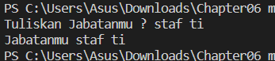
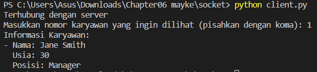
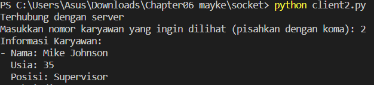
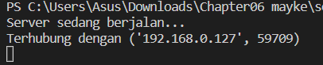
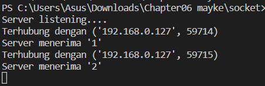

https://youtu.be/bTrxFeT4GJ8

link youtobe : https://youtu.be/-TWUTms6BEc

Celery adalah sebuah framework Python yang digunakan untuk mengimplementasikan task queue atau antrian tugas terdistribusi. Framework ini memungkinkan Anda untuk menjalankan tugas-tugas yang memakan waktu lama atau berat secara asinkron, baik secara terdistribusi maupun dalam satu mesin.

hasil dari celery :

Pyro4 adalah sebuah framework Python yang digunakan untuk memudahkan implementasi Remote Procedure Call (RPC) atau pemanggilan prosedur jarak jauh. RPC adalah mekanisme yang memungkinkan pemanggilan fungsi atau metode yang berada pada objek yang berada di mesin atau proses yang berbeda melalui jaringan.

Socket adalah sebuah konsep yang digunakan dalam komunikasi jaringan untuk menghubungkan dua komputer atau perangkat dengan cara mengirim dan menerima data. Secara lebih teknis, socket adalah antarmuka pemrograman yang menyediakan mekanisme untuk berkomunikasi antara aplikasi dengan jaringan komputer.

