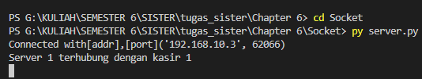
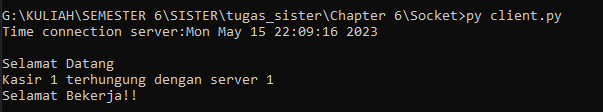
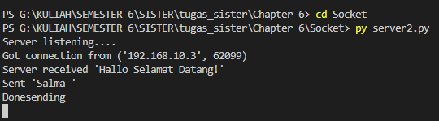
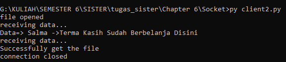
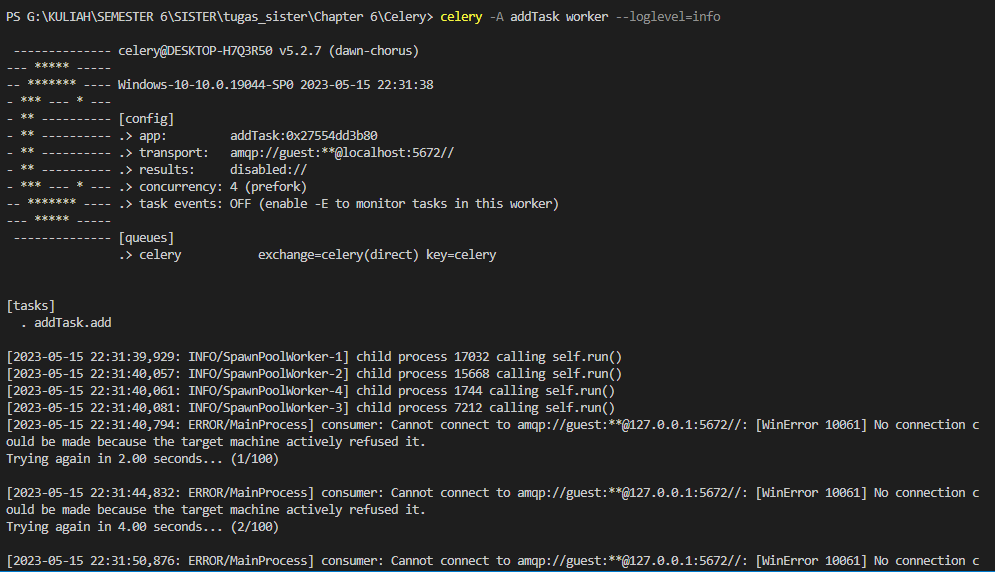
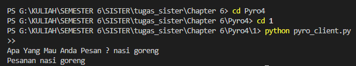
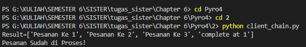

1. Soket merupakan objek perangkat lunak yang memungkinkan data dikirim dan diterima antara host jarak jauh (melalui jaringan) atau antar proses lokal, seperti Inter-Process Communication (IPC).

pada project socket 1 mangambil studi kasus tentang kasir pada sebuah swalayan yang terhubung dengan server.
tampilan pada server seperti berikut ini :

tampilan pada client seperti berikut ini :

pada project socket 2 mengambil studi kasus tentang otomatis menerima nama pelanggan pada sebuah swalayan yang telah berbelanja di swalayan tersebut
tampilan pada server sebagai berikut :

tampilan pada client sebagai berikut :

2. Celery merupakan kerangka kerja Python yang mengelola tugas terdistribusi dengan mengikuti pendekatan middleware berorientasi objek. Fitur utamanya adalah menangani banyak tugas kecil dan
mendistribusikannya di banyak node komputasi. Akhirnya, hasil dari setiap tugas akan menjadi
ulang untuk menyusun solusi keseluruhan

hasil dari celery :

3. Pyro merupakan kependekan dari Python Remote Objects. Ia bekerja persis seperti Java RMI (pendek
untuk Pemanggilan Metode Jarak Jauh) memungkinkan untuk memanggil metode objek jarak jauh (milik
ke proses yang berbeda) persis seolah-olah objek itu lokal (milik proses yang sama di
mana doa dijalankan).

pada project pyro 1 mangambil studi kasus tentang pesanan pelanggan pada sebuah rumah makan dimana server menanya apa yang mau di pesan oleh pelanggan, lalu server kembali mengecek pesanan yang di pesan oleh pelanggan.

hasil seperti berikut ini :

pada project pyro 2 mangambil studi kasus tentang pesanan pelanggan yang di proses setelah menerima semua pesanan.

hasil seperti berikut ini :

link video penjelasan : https://youtu.be/abLYI6VMOqA