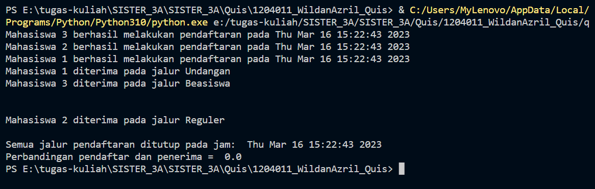

Pada quis kali ini saya menggunakan multithreading, barrier dengan menggunakan study kasus Penerimaan Mahasiswa Baru, dimana terdapat 3 jalur pendaftaran dan 3 mahasiswa yang mendaftar. Dalam prosesnya akan mengetahui kapan ketiga mahasiswa tersebut mendaftar dan selesai melakukan pendaftaran serta jalur mana yang diterima oleh mahasiswa tersebut.
Kode program tersebut menggunakan modul threading untuk melakukan threading pada objek jalur. Modul threading adalah modul bawaan Python yang digunakan untuk mengimplementasikan threading dalam program.
Pada awal program, objek Barrier dibuat dengan jumlah thread yang akan dijalankan, yaitu 3. Objek ini digunakan untuk membuat thread-thread yang ada pada program menunggu satu sama lain sebelum melanjutkan eksekusinya.
Kemudian, terdapat kelas jalur yang memiliki dua atribut, yaitu nama dan jenis, dan memiliki satu method yaitu jalur_tentu(). Method ini digunakan untuk menampilkan pesan pembukaan dan penutupan pendaftaran, serta menunggu di Barrier sebelum menampilkan pesan bahwa peserta diterima pada jalurnya.
Setelah kelas jalur didefinisikan, terdapat tiga objek jalur yang dibuat yaitu jalur1, jalur2, dan jalur3. Setiap objek ini akan dijalankan pada thread yang berbeda.
Kemudian, ketiga thread dibuat menggunakan modul threading. Setiap thread dibuat dengan memanggil method jalur_tentu() pada objek jalur yang sesuai. Kemudian, ketiga thread tersebut dijalankan dengan memanggil method start(). Setelah thread-thread selesai dieksekusi, program menampilkan pesan bahwa semua jalur pendaftaran telah ditutup, dan menampilkan perbandingan waktu mulai dan selesai program dijalankan.

