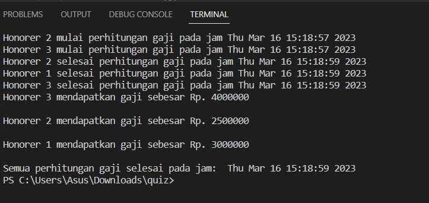

Kode di atas adalah contoh penggunaan threading untuk menghitung gaji dari tiga honorer secara bersamaan.

Pertama-tama, diinisialisasi sebuah objek Barrier dengan jumlah thread yang akan dijalankan, yaitu tiga. Barrier digunakan untuk menahan eksekusi semua thread hingga semua thread siap melanjutkan eksekusi selanjutnya, sehingga tidak ada thread yang akan memproses data sebelum semua thread selesai menghitung gaji.

Kemudian, dibuat sebuah class Honorer dengan dua atribut, yaitu nama dan gaji, serta satu method hitung_gaji() yang digunakan untuk menghitung gaji dari masing-masing honorer. Method hitung_gaji() memiliki tiga langkah, yaitu mencetak pesan awal, menunda eksekusi thread selama dua detik untuk mensimulasikan proses perhitungan gaji, mencetak pesan akhir, dan menunggu di barrier sehingga tidak ada thread yang akan memproses data sebelum semua thread selesai menghitung gaji.

Setelah itu, dibuat tiga objek Honorer dengan data honorer yang berbeda, yaitu honorer1, honorer2, dan honorer3.

Kemudian, tiga thread baru dibuat untuk masing-masing honorer dengan menggunakan method Thread dari modul threading. Thread-thread tersebut dijalankan dengan menggunakan method start(), dan untuk menunggu semua thread selesai, method join() digunakan.

Terakhir, pesan "Semua perhitungan gaji selesai pada jam: [waktu sekarang]" dicetak untuk menandakan bahwa semua thread telah selesai dan program berakhir.

Hasil Screenshoot program
