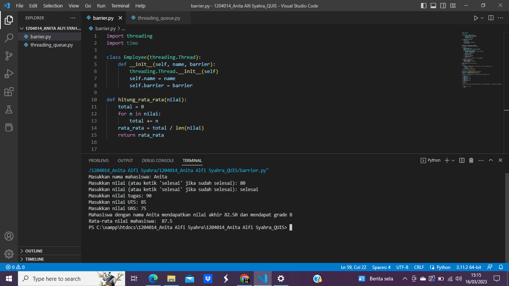

Pada saat Quis, file barrier tersebut meminta pengguna untuk memasukkan nama mahasiswa, nilai tugas, nilai UTS, dan nilai UAS. Setelah nilai-nilai tersebut dimasukkan, program akan menghitung nilai akhir dan menampilkan grade yang didapatkan oleh mahasiswa tersebut.

lalu pada file threading_queue tersebut program akan menunggu hingga kedua thread selesai dijalankan sebelum menampilkan pesan "Program telah selesai". Selain itu, ketika thread "Input Nilai dimulai", pesan "Thread Input memulai menginput nilai" akan ditampilkan, dan ketika thread tersebut selesai, pesan "Thread Input telah selesai menginput nilai" akan ditampilkan. Demikian pula, ketika thread HitungRataRata dimulai, pesan "Thread Hitung memulai menghitung nilai rata-rata" akan ditampilkan, dan ketika thread tersebut selesai, pesan "Thread Hitung telah selesai menghitung nilai rata-rata" akan ditampilkan.

.png)