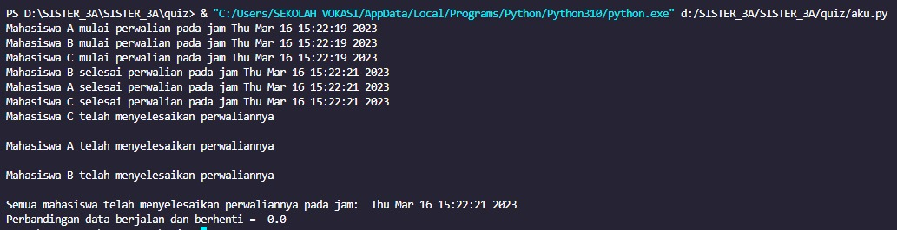

kode quis ini adalah sebuah program yang menggunakan konsep threading pada bahasa pemrograman Python. Program tersebut melakukan simulasi perwalian mahasiswa di universitas.

Pada awal kode, library threading dan time diimport untuk digunakan pada program. Kemudian, objek barrier diinisialisasi dengan jumlah thread yang akan dijalankan. Barrier adalah objek sinkronisasi yang memungkinkan satu set thread untuk menunggu satu sama lain sampai semua thread siap untuk melanjutkan eksekusi secara bersamaan. Pada program ini, barrier diatur untuk menunggu 3 thread.

Kemudian, kelas Mahasiswa didefinisikan dengan dua atribut yaitu nama dan nrp. Setiap instance kelas Mahasiswa memiliki method perwalian() yang digunakan untuk menampilkan pesan bahwa mahasiswa tersebut mulai melakukan perwalian pada jam tertentu, menunggu selama 2 detik, menampilkan pesan bahwa mahasiswa tersebut telah menyelesaikan perwalian pada jam tertentu, dan kemudian menunggu di barrier.

Selanjutnya, tiga objek mahasiswa (mhs1, mhs2, mhs3) dibuat menggunakan kelas Mahasiswa. Setiap objek mahasiswa kemudian digunakan untuk membuat thread baru (t1, t2, t3) dengan target method perwalian() yang ada pada kelas Mahasiswa.

Kemudian, ketiga thread dijalankan menggunakan method start(). Setelah thread selesai dieksekusi, program menampilkan pesan bahwa semua mahasiswa telah menyelesaikan perwaliannya pada jam tertentu. Waktu eksekusi program juga dicatat dengan menggunakan variabel start_time dan end_time.

Terakhir, program menampilkan selisih waktu antara start_time dan end_time yang menunjukkan berapa lama waktu yang dibutuhkan untuk menjalankan program secara keseluruhan.

Hasil Screenshoot program
