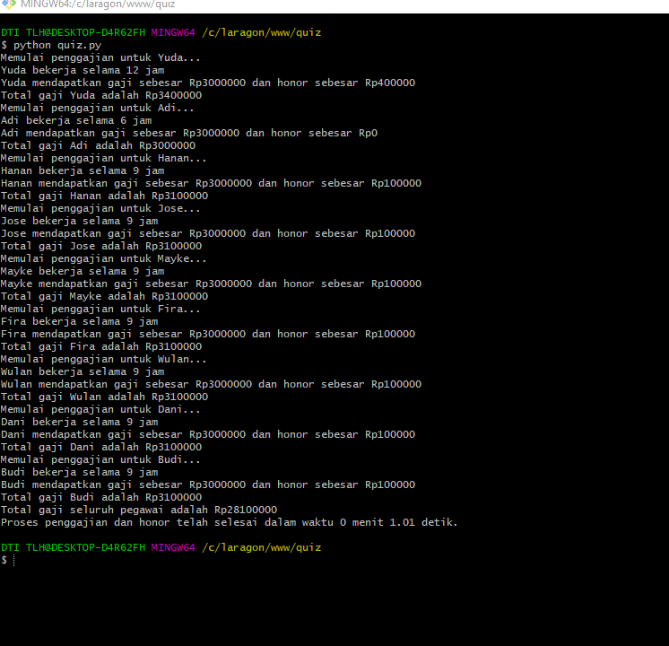

Program yang sudah dibuat implementasi untuk menggaji seorang karyawan atau pegawai. Ketika dijalankan akan menghitung
masing masing dari gaji pegawai dan memberikan honor kepada pegawai yang telah bekerja lebih dari 8 jam.
Pada awal program, diinisialisasi daftar pegawai dan waktu kerja masing-masing pegawai dalam bentuk dictionary. Selanjutnya, objek lock dibuat untuk menghindari terjadinya race condition saat melakukan operasi pada shared resource.
Program selanjutnya membuat objek thread untuk setiap pegawai yang akan digaji dan dimasukkan ke dalam list threads. Objek queue juga dibuat untuk mengumpulkan hasil total gaji setiap pegawai.
Ketika semua objek thread telah dibuat, program memberikan sinyal untuk menunggu selama 3 detik sebelum memulai proses penggajian. Kemudian, program memulai setiap thread untuk menjalankan proses penggajian.
Setelah semua penggajian selesai, program akan menjumlahkan total gaji dari setiap pegawai dan mencetak hasilnya. Program juga menghitung selisih waktu dan mencetak waktu yang dibutuhkan untuk menjalankan proses penggajian.

