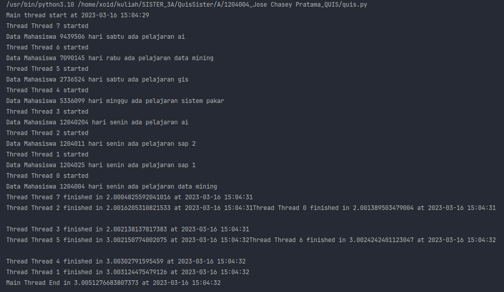

Program ini menggunakan lock dan barrier untuk menghindari masalah race condition dan memastikan semua thread selesai sebelum menyelesaikan program. Disini saya menggunakan studi kasus Jadwal kuliah.

Pertama-tama, program mendefinisikan sebuah list jadwalMhs, yang berisi jadwal mahasiswa dalam bentuk dictionary. Kemudian, program menggunakan loop for untuk menambahkan data jadwal mahasiswa secara acak ke dalam list.

Program kemudian mendefinisikan sebuah thread lock dan barrier. Thread lock digunakan untuk memastikan bahwa hanya satu thread yang dapat mengakses data jadwal mahasiswa pada satu waktu, sedangkan thread barrier digunakan untuk menunda eksekusi semua thread sampai semua thread selesai.

Program selanjutnya mendefinisikan fungsi job1, yang merupakan fungsi yang akan dieksekusi oleh setiap thread. Fungsi ini menggunakan lock untuk mengambil satu item dari list jadwalMhs, mencetak jadwal mahasiswa yang diambil, dan kemudian menunggu selama waktu yang acak antara 1 hingga 3 detik sebelum mencetak bahwa thread selesai dan menyelesaikan tugas. Disini job1 menggunakan barrier dan lock, lock digunakan untuk mencegah kondisi race karena mengubah variabel global yang digunakan pada thread lain. Tujuan penggunaan barrier pada kode ini adalah untuk menunggu semua thread selesai menjalankan tugasnya sebelum menjalankan tugas selanjutnya pada main thread. Barrier ini digunakan untuk melakukan sinkronisasi antar thread, sehingga setiap thread harus menunggu thread lainnya selesai menjalankan tugas sebelum tugas berikutnya pada main thread dapat dilanjutkan

Program kemudian mendefinisikan fungsi main, yang merupakan fungsi utama program. Fungsi ini mencetak pesan bahwa thread utama dimulai, kemudian membuat objek thread sebanyak jumlah item dalam list jadwalMhs, dan membalikkan urutan thread agar thread terakhir yang dibuat dieksekusi terlebih dahulu.

Program kemudian memulai setiap thread, menunggu setiap thread selesai, dan kemudian mencetak pesan bahwa thread utama selesai dan waktu total eksekusi.

