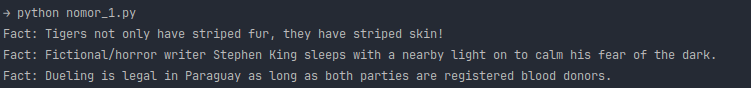
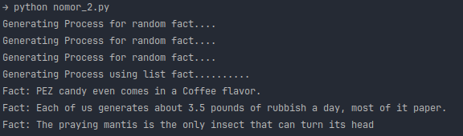
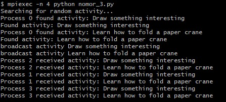
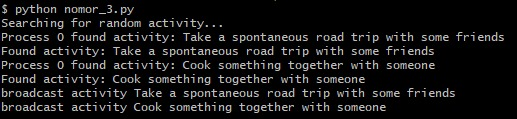

## UTS
Studi kasus yang dipakai adalah fakta generator. 
program ini akan menampilkan fakta - fakta yang diambil dari api [Random Useless Facts](https://uselessfacts.jsph.pl/)
menggunakan http.client dari bawaan python.

1. Menggunakan Spawning a process dengan modul multiprocessing. Outputnya :

2. Program ini menggunakan http lib untuk mengambil fakta. Outputnya :

3. Mengimplementasikan mpi4py dengan menggunakan PTPC.
   Output menggunakan mpi4py :

Output tanpa menggunakan mpi4py :

