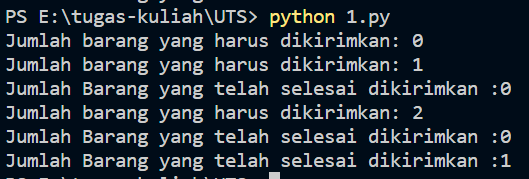
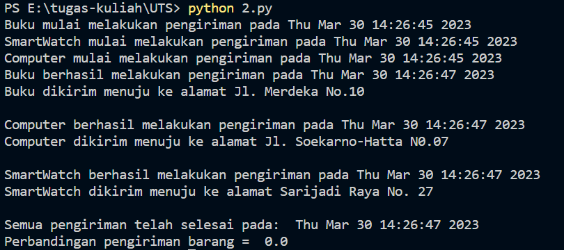
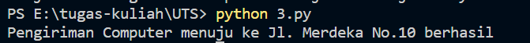
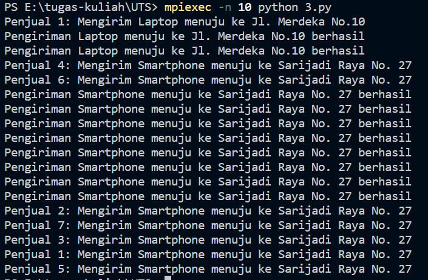

## UTS

Studi Kasus yang digunakan yaitu pada bidang Distribusi Logistik. Dalam penggunaanya, program ini memberitahukan barang apa saja yang akan dikirimkan dan alamat tujuan pengiriman.

1. Menggunakan Spawning a process dengan modul multiprocessing. Dalam studi kasus yang diambil, mengimplementasikan jumlah barang yang harus dikirim dan jumlah barang yang telah dikirim. Outputnya :

2. Program ini mengimplementasikan sebuah simulasi pengiriman barang dengan menggunakan tiga proses yang berjalan secara paralel. Diantaranya proses mulai melakukan pengiriman barang, proses barang berhasil dikirimkan, dan barang dikirimkan ke alamat yang sesuai.  Outputnya :

3. Mengimplementasikan MPI4PY dengan menggunakan PTPC. Dalam program ini mengimplementasikan penjual akan melakukan pengiriman barang menuju alamat yang dituju dan memberikan informasi barang telah selesai dikirimkan. 

Output tanpa menggunakan MPI4PY :

Output menggunakan MPI4PY :

