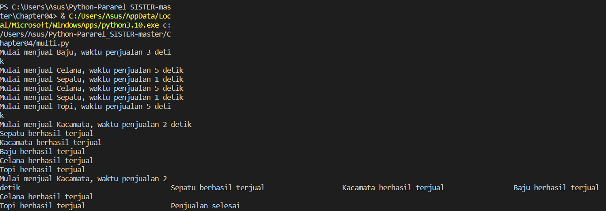
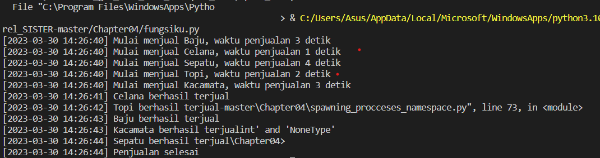
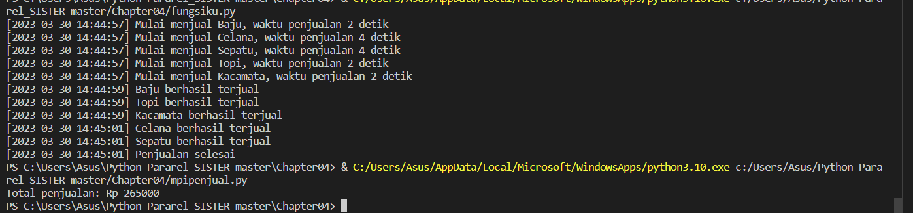

soal no 1
Program ini menggunakan dua fungsi yaitu penjualan_barang dan spawn_processes. Fungsi penjualan_barang digunakan untuk mensimulasikan proses penjualan satu barang, dimana proses penjualan membutuhkan waktu acak antara 1 hingga 5 detik. Fungsi spawn_processes digunakan untuk memulai proses penjualan sejumlah barang.Pada bagian akhir program, terdapat pemanggilan fungsi spawn_processes untuk menjalankan proses penjualan untuk setiap barang yang ada di list_barang. Setelah semua proses penjualan selesai, maka program akan mencetak pesan "Penjualan selesai".

soal no2
Program di atas menggunakan modul multiprocessing untuk melakukan parallel processing saat menjual barang. Program akan menjual setiap barang dalam list list_barang dengan menginisialisasi proses menggunakan method multiprocessing.Process() dan menambahkan proses ke dalam list proses_penjualan. Selanjutnya, program akan menjalankan setiap proses menggunakan method start(). Setelah semua proses selesai, program akan menunggu hingga semua proses selesai dengan menggunakan method join(). Terakhir, program akan mencetak pesan bahwa penjualan telah selesai.

soal no3
mengimplementasikan mpi mennggunakan ptpc
Program di atas menggunakan multiprocessing untuk memproses beberapa pesanan secara paralel. Pertama, data pesanan disiapkan dalam bentuk daftar orders, kemudian antrian results dibuat untuk menyimpan total penjualan.
Selanjutnya, setiap pesanan diproses dalam proses terpisah menggunakan Process. Proses-proses tersebut dijalankan secara paralel dengan start(). Setelah semua proses selesai, program menghitung total penjualan dari hasil di antrian results dengan mengeluarkan nilai dari setiap elemen dalam antrian dan menambahkannya ke variabel total_sales. Akhirnya, total penjualan ditampilkan pada layar dengan format yang sesuai menggunakan fungsi print().
