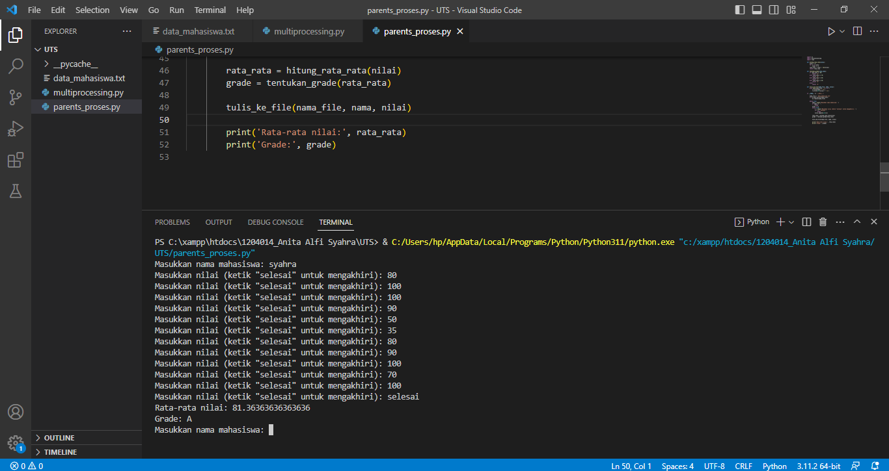
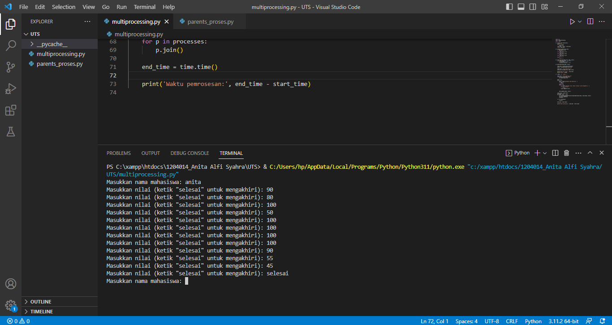

program akan meminta input data mahasiswa dan nilai dari user. Program akan menghitung rata-rata dan grade dari nilai tersebut, dan menuliskan data mahasiswa dan nilai ke dalam file. Program akan berhenti jika user memasukkan nama mahasiswa kosong.

program akan meminta input data mahasiswa dan nilai dari user. Program akan menghitung rata-rata dan grade dari 
nilai tersebut, dan menuliskan data mahasiswa dan nilai ke dalam file. Program menggunakan multiprocessing untuk melakukan pemrosesan data secara paralel. Setiap pemrosesan data akan dijalankan di dalam sebuah proses yang berbeda. Program juga akan menampilkan waktu pemrosesan.

