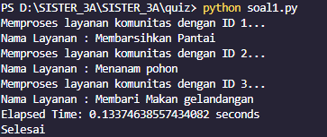
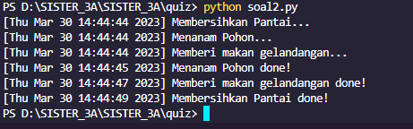
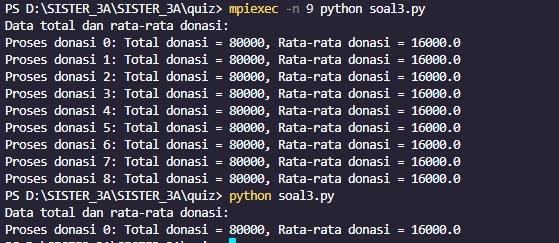

Penjelasan soal 1
Pada kode ini, terdapat sebuah fungsi bernama process_service yang akan dipanggil pada setiap proses yang akan dijalankan. Fungsi tersebut menerima satu parameter service_data yang merupakan data sebuah layanan komunitas yang akan diproses. Fungsi ini hanya mencetak pesan ke layar untuk menunjukkan bahwa layanan sedang diproses. Selanjutnya, terdapat fungsi spawn_processes yang akan menginisiasi proses-proses baru dengan memanggil fungsi process_service pada setiap data layanan komunitas yang ada. Fungsi ini menerima satu parameter community_services yang merupakan daftar data layanan komunitas yang akan diproses. Pada bagian ini, terdapat penggunaan loop untuk membuat proses baru dengan menggunakan modul multiprocessing.Process. Setiap proses yang dibuat akan memanggil fungsi process_service dengan parameter data layanan komunitas yang berbeda-beda. Setelah semua proses sudah dibuat, proses-proses tersebut akan dijalankan dan dipastikan selesai menggunakan method start() dan join(). Pada bagian utama program, terdapat penggunaan blok if __name__ == '__main__': yang akan menjalankan fungsi spawn_processes dengan parameter daftar data layanan komunitas yang ada pada variabel community_services_to_process. Waktu mulai dan selesai pemrosesan ditampilkan pada layar dengan menggunakan modul time untuk mengukur waktu yang dibutuhkan oleh program untuk menyelesaikan semua proses. Sebagai hasil akhir, program akan mencetak pesan "Selesai" pada layar untuk menunjukkan bahwa program sudah selesai dieksekusi.

Penjelasan soal 2
Pada kode tersebut, terdapat tiga fungsi yaitu clean_beach(), plant_trees(), dan feed_homeless(). Ketiga fungsi tersebut hanya mencetak pesan ke layar untuk menunjukkan bahwa tugas sedang diproses. Masing-masing fungsi juga menggunakan time.sleep() dengan durasi acak antara 1 sampai 5 detik untuk mensimulasikan pekerjaan yang memerlukan waktu.Pada blok utama program, terdapat penggunaan multiprocessing.Process() untuk membuat tiga proses yang berbeda. Setiap proses akan dipanggil dengan memanggil fungsi yang berbeda.Setelah proses-proses dibuat, program akan menjalankan semua proses secara parallel dengan memanggil method start() pada setiap proses. Setelah semua proses dijalankan, program akan memastikan bahwa semua proses selesai sebelum program berakhir dengan menggunakan method join() pada setiap proses. Karena ketiga proses dijalankan secara parallel, maka output yang dihasilkan tidak bisa dipastikan urutannya. Terkadang, pesan "Membersihkan Pantai..." muncul terlebih dahulu, terkadang pesan "Menanam Pohon..." yang muncul terlebih dahulu. Namun, setiap tugas akan tetap selesai dalam rentang waktu 1 sampai 5 detik yang diatur oleh fungsi time.sleep().

Penjelasan soal 3
Pada blok pertama program, terdapat inisialisasi objek comm sebagai communicator dan variabel rank dan size yang menunjukkan nomor rank dan jumlah total proses. Rank merupakan identitas unik untuk setiap proses yang berbeda-beda dan dimulai dari 0. Size menunjukkan jumlah total proses yang ada.Pada blok kedua program, jika rank adalah 0 maka variabel n dan donatur diinisialisasi. n menunjukkan jumlah total donatur dan donatur adalah sebuah list yang berisi tuple-tuple dengan elemen nama dan jumlah donasi. Jika rank bukan 0, maka variabel donatur dan n diinisialisasi menjadi None.Pada blok ketiga program, variabel donatur dan n di-broadcast (dikirim ke semua proses) dengan menggunakan method bcast() pada objek communicator comm. Sehingga semua proses memiliki akses terhadap variabel donatur dan n.Selanjutnya, pada blok keempat program, setiap proses akan menghitung total donasi dan rata-rata donasi dari variabel donatur dan n yang telah dibroadcast. Kemudian, setiap proses akan mengirimkan hasil perhitungan tersebut ke proses 0 menggunakan method gather(). Proses 0 akan menerima data dari setiap proses dan menyimpannya pada variabel data_total_rata_donasi.Pada blok kelima program, jika rank adalah 0, maka hasil perhitungan total dan rata-rata donasi akan dicetak ke layar.Dalam MPI, program dijalankan pada setiap proses secara parallel dan masing-masing proses memiliki data dan tugas yang berbeda. Komunikasi antar proses dapat dilakukan dengan menggunakan berbagai method MPI seperti bcast() dan gather() yang digunakan pada program di atas.
