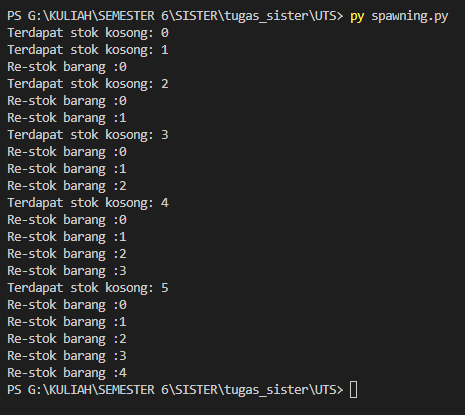
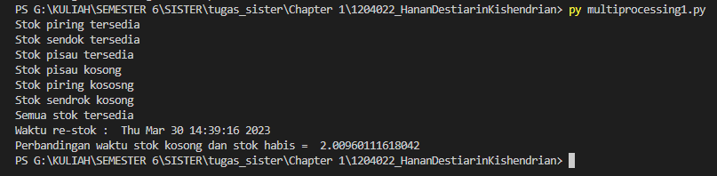
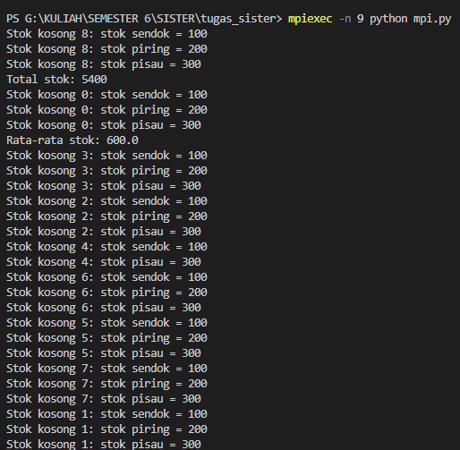

pada test kali ini saya mengambil studi kasus tentang stok barang tersedia dan tidak serta waktu re-stok barang sebagai berikut :

1. spawning.py
   menggunakan modul multiprocessing untuk menjalankan beberapa proses, menghasilkan output seperti berikut ini :
   

2. multiprocessing1.py
   menggunakan modul multiprocessing dan time, terdapat function sendok(), piring(), dan pisau), berisi keterangan stok barang piring, sendok, dan pisau tersedia atau tidak serta keterangan waktu re-stok dan perbandingan stok kosong dan stok habis, menghasilkan output seperti berikut ini :
   

3. mpi.py
   menggunakan library mpi4py untuk melakukan komunikasi paralel antar proses, berisi stok barang kosong dan jumlah stok, total stok, serta rata-rata stok, menghasilkan output seperti berikut ini:
   menggunakan py mpi.py :
   

   menggunakan mpiexec -n 9 python mpi.py :
   
