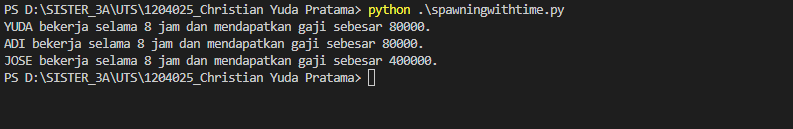
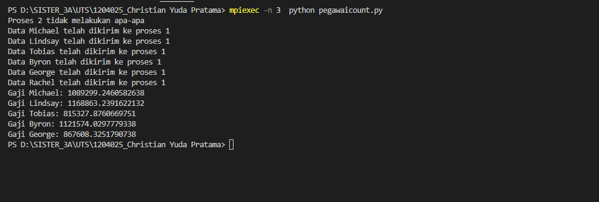

Kode ini adalah program Python yang menggunakan modul multiprocessing untuk melakukan pemrosesan tugas secara paralel pada beberapa pegawai dan tugas-tugas yang telah ditentukan. Modul multiprocessing digunakan untuk mempercepat eksekusi program dengan memproses tugas-tugas secara bersamaan pada beberapa proses yang berbeda.

Kode di atas adalah contoh program Python yang menggunakan modul multiprocessing untuk melakukan perhitungan gaji pada beberapa pekerja secara paralel. Pertama-tama, program mendefinisikan fungsi hitung_gaji() yang akan melakukan perhitungan gaji berdasarkan gaji per jam dan jam kerja, kemudian menampilkan hasilnya pada layar menggunakan fungsi print().

Program di atas menggunakan MPI (Message Passing Interface) dengan modul mpi4py untuk melakukan komunikasi dan pemrosesan data secara paralel pada beberapa proses yang berbeda. Program ini memiliki tiga proses, yaitu proses dengan rank 0, proses dengan rank 1, dan proses dengan rank selain 0 dan 1. Proses dengan rank 0 mengambil data dari API menggunakan library requests, lalu memproses data tersebut dengan mengambil first name setiap user dan mengirimkannya ke proses 1 menggunakan fungsi comm.send(). Proses dengan rank 1 menerima data first name dari proses 0 menggunakan fungsi comm.recv(), lalu menghitung gaji dengan memperoleh gaji pokok dan mengalikan dengan faktor acak antara 0.8 hingga 1.2. Hasil perhitungan gaji kemudian ditampilkan pada layar menggunakan print(). Program ini berguna untuk memproses data secara paralel pada beberapa proses untuk mengoptimalkan waktu eksekusi dan meningkatkan efisiensi program.